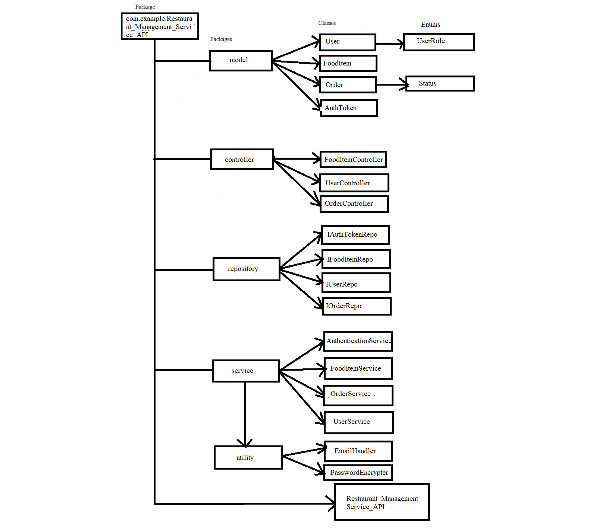

## **Frameworks and language used**
* SpringBoot Framework and java language.
## **Data Flow**

## **Data Structure used in your project**
* Arraylist
## **Project Summary**

This is "User_Management_System" Application which follows MVC-architecture.I have created this project by spring initilizer by taking 3 dependency i.e., lombok, spring web and Validation. The main purpose is to perform Validation. In my user class I have User data i.e., Id, Name, DOB, Email, PhoneNumber, Date and Time, for all this userInfo I have use some Validation like @NOTNUll, @NotBlANK, @Email,etc. In controller class I have perform all CRUD operation i.e., @GetMapping,@PostMapping,@PutMapping,@DeleteMapping.And listed the result by using POSTMAN.

