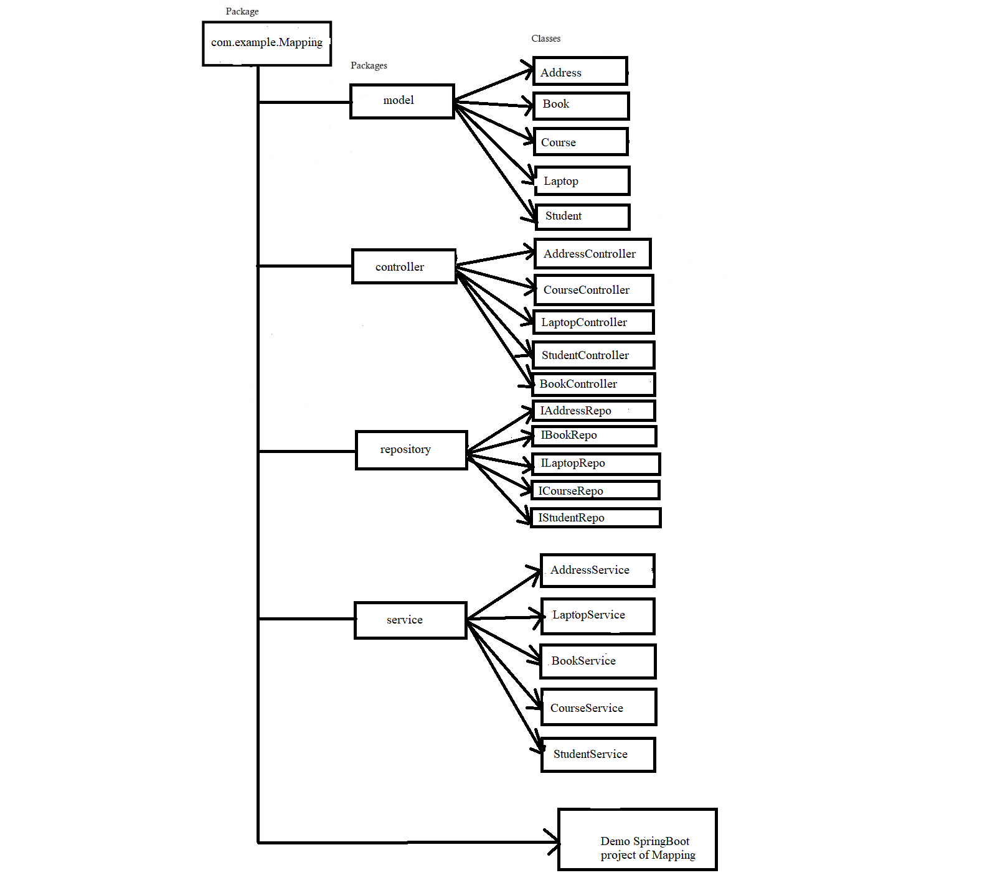

## **Frameworks and language used**
* SpringBoot Framework and java language.
## **Data Flow**

## **Data Structure used in your project**
* Arraylist
* MYSQL Database
## **Project Summary**

This is "Mapping" Application which follows MVC-architecture.I have created this project by spring initilizer by taking 6 dependency i.e., lombok, spring web,MYSQL,JPA,Swagger,Validation. In my model package I have Address,Course,Book,Laptop,Student class which has all its related data and my controller package I have performed @PostMapping,@GetMapping,@DeleteMapping and @PutMapping and call it by using Swagger.The main purpose was to perform Relationship between these classes.

